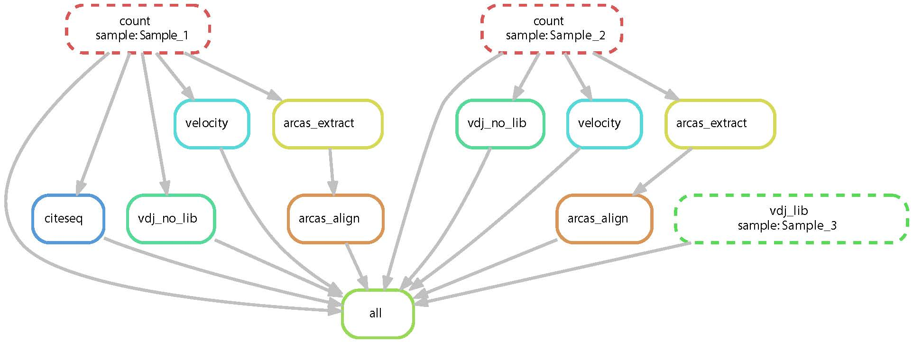

# Mammatus 10x single-cell RNAseq pipeline

This repo is a snakemake pipeline that begins with demulitplexed FASTQ files from 10x genomics single-cell RNAseq data and encapsulates creating gene expression feature barcode matrices, alignment of CITEseq data, assembly of vdj regions using TRUST4 from either amplified vdj libraries or standard libraries, generation of RNA velocity data, and HLA typing with arcasHLA.

The workflow assumes snakemake has been installed and a profile "slurm_htc" has been created to interact with the SLURM system.

## Create samples.csv

The workflow begins with describing the input and output files and paths using the "samples.csv" file. This file is used to create the directed acyclic graph (DAG) to begin the pipeline based on the tasks required.

## Create and check the DAG

After "samples.csv" has been created, we can use

> snakemake --dag | dot -Tpdf > dag.pdf

to visualize the DAG. This allows us to understand the links between tasks for a particular initialization of the pipeline based on the tasks described in
"samples.csv".

## Run the pipeline

Finally, we can run the pipeline with

> snakemake --profile slurm_htc --jobs=10
